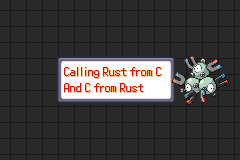

## Bindgen

### header.h
```c
int toast(int a, int b);

struct Struct {
  char *str;
  unsigned int number;
};

char takes_struct(struct Struct *s);
```

### bindings.rs
```rust
/* automatically generated by rust-bindgen 0.71.1 */
unsafe extern "C" {
    pub fn toast(a: ::std::os::raw::c_int, b: ::std::os::raw::c_int)-> ::std::os::raw::c_int;
}
#[repr(C)]
#[derive(Debug, Copy, Clone)]
pub struct Struct {
    pub str_: *mut ::std::os::raw::c_char,
    pub number: ::std::os::raw::c_uint,
}
unsafe extern "C" {
    pub fn takes_struct(s: *mut Struct) -> ::std::os::raw::c_char;
}
```