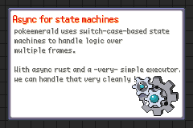

## Async and state machines

```c
static bool8 ShowPartyMenu(void)
{
    switch (gMain.state)
    {
    case 0:
        SetVBlankHBlankCallbacksToNull();
        gMain.state++;
        break;
    case 1:
        ScanlineEffect_Stop();
        gMain.state++;
        break;
    /** ... */
    case 20:
        if (AllocPartyMenuBgGfx())
            gMain.state++;
        break;
    default:
        return TRUE;
    }
    return FALSE;
}

static bool8 AllocPartyMenuBgGfx(void)
{
    u32 sizeout;

    switch (sPartyMenuInternal->data[0])
    {
    case 0:
        LoadBgTiles();
        sPartyMenuInternal->data[0]++;
        break;
    /* ... */
    case 7:
        PartyPaletteBufferCopy(8);
        sPartyMenuInternal->data[0]++;
        break;
    default:
        return TRUE;
    }
    return FALSE;
}
```