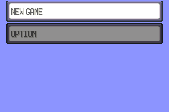

This is an archive of my tupperrust presentation on rust in in pokeemerald.

The actual code for the presentation can be found [here](../rust/src/presentation.rs)

## [Intro slides](./00-intro.md)
## [Rust from C](./01-RustFromC.md)
## [C From Rust](./02-CFromRust.md)
## [bindgen](./03-Bindgen.md)
## [Panic handler and allocator](./04-panic.md)
## [Unsafe abstractions](./05-unsafe.md)
## [Charmap and const](./06-const.md)
## [Async state machines 1](./07-async.md)
## [Async state machines 2](./08-async.md)
## [PhantomData lifetimes](./09-PhantomData.md)
## [Outro slides](./10-outro.md)
